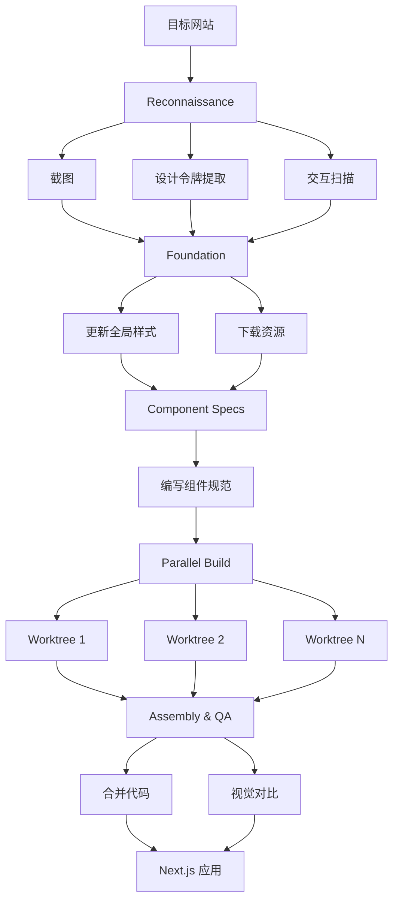

# AI Website Cloner Template 项目分析报告

## 项目概览

**项目名称**: AI Website Cloner Template  
**GitHub Stars**: 11,413  
**主要语言**: TypeScript  
**许可证**: MIT  
**项目描述**: Clone any website with one command using AI coding agents

> 这是一个可复用的模板，用于使用 AI 编码代理将任何网站逆向工程为干净、现代的 Next.js 代码库。只需指向一个 URL，运行 `/clone-website`，AI 代理将检查网站、提取设计令牌和资源、编写组件规范，并并行构建每个部分。

---

## 技术栈分析

### 核心技术
| 技术 | 用途 | 版本 |
|------|------|------|
| **Next.js** | React 框架 | 16.2.1 |
| **React** | UI 库 | 19.2.4 |
| **TypeScript** | 类型系统 | 5.x |
| **Tailwind CSS** | CSS 框架 | v4 |
| **shadcn/ui** | UI 组件库 | 4.1.0 |
| **Lucide React** | 图标库 | 1.6.0 |

### 开发工具
| 工具 | 用途 |
|------|------|
| **ESLint** | 代码检查 |
| **PostCSS** | CSS 处理 |
| **class-variance-authority** | 组件变体管理 |
| **tailwind-merge** | Tailwind 类合并 |

### AI Agent 支持
| 平台 | 支持状态 |
|------|----------|
| **Claude Code** | 推荐 (Opus 4.6) |
| **Codex CLI** | 支持 |
| **OpenCode** | 支持 |
| **GitHub Copilot** | 支持 |
| **Cursor** | 支持 |
| **Windsurf** | 支持 |
| **Gemini CLI** | 支持 |
| **Cline** | 支持 |
| **Roo Code** | 支持 |
| **Continue** | 支持 |
| **Amazon Q** | 支持 |
| **Augment Code** | 支持 |
| **Aider** | 支持 |

---

## 核心功能模块

### 1. 网站克隆流程
```
/clone-website <target-url>
    ↓
1. Reconnaissance (侦察)
   - 截图
   - 设计令牌提取
   - 交互扫描 (滚动、点击、悬停、响应式)
   
2. Foundation (基础)
   - 更新字体、颜色、全局样式
   - 下载所有资源
   
3. Component Specs (组件规范)
   - 编写详细规范文件
   - 精确计算 CSS 值
   - 状态、行为、内容定义
   
4. Parallel Build (并行构建)
   - Git worktrees 分发
   - 每个部分独立构建
   
5. Assembly & QA (组装与质检)
   - 合并 worktrees
   - 页面连接
   - 视觉对比验证
```

### 2. 多平台技能同步
| 源文件 | 同步命令 | 目标平台 |
|--------|----------|----------|
| AGENTS.md | `sync-agent-rules.sh` | 所有平台规则文件 |
| `.claude/skills/clone-website/SKILL.md` | `sync-skills.mjs` | 各平台技能文件 |

### 3. 设计令牌提取
- **颜色**: oklch 格式设计令牌
- **字体**: 字体家族、字重、行高
- **间距**: 边距、内边距系统
- **阴影**: 阴影层级
- **动画**: 过渡和关键帧

---

## 代码结构概览

```
ai-website-cloner-template/
├── src/
│   ├── app/                      # Next.js App Router
│   │   ├── favicon.ico
│   │   ├── globals.css           # 全局样式
│   │   ├── layout.tsx            # 根布局
│   │   └── page.tsx              # 首页
│   ├── components/               # React 组件
│   │   ├── ui/                   # shadcn/ui 组件
│   │   │   └── button.tsx
│   │   └── icons.tsx             # 提取的 SVG 图标
│   ├── hooks/                    # 自定义 Hooks
│   ├── lib/
│   │   └── utils.ts              # cn() 工具函数
│   └── types/                    # TypeScript 类型
│
├── public/                       # 静态资源
│   ├── images/                   # 下载的图片
│   ├── videos/                   # 下载的视频
│   └── seo/                      # SEO 资源 (favicon, OG)
│
├── docs/
│   ├── research/                 # 检查结果
│   │   └── INSPECTION_GUIDE.md   # 检查指南
│   └── design-references/        # 设计参考
│       └── comparison.png        # 对比图
│
├── scripts/                      # 脚本工具
│   ├── sync-agent-rules.sh       # 同步代理规则
│   └── sync-skills.mjs           # 同步技能文件
│
├── .claude/skills/               # Claude 技能
│   └── clone-website/
│       └── SKILL.md              # 29.6 KB 技能定义
│
├── .github/                      # GitHub 配置
│   ├── copilot-instructions.md   # Copilot 指令
│   └── skills/                   # GitHub Skills
│
├── .cursor/                      # Cursor 配置
├── .windsurf/                    # Windsurf 配置
├── .codex/                       # Codex 配置
├── .continue/                    # Continue 配置
├── .opencode/                    # OpenCode 配置
├── .amazonq/                     # Amazon Q 配置
├── .augment/                     # Augment 配置
├── .gemini/                      # Gemini 配置
│
├── AGENTS.md                     # 代理指令源文件
├── CLAUDE.md                     # Claude 配置
├── GEMINI.md                     # Gemini 配置
├── components.json               # shadcn 配置
├── next.config.ts                # Next.js 配置
├── package.json                  # 依赖配置
├── tsconfig.json                 # TypeScript 配置
├── tailwind.config.*             # Tailwind 配置
├── eslint.config.mjs             # ESLint 配置
├── Dockerfile                    # Docker 配置
└── docker-compose.yml            # Docker Compose
```

---

## 关键实现亮点

### 1. 多平台统一配置
```bash
# 源文件 -> 多平台同步
AGENTS.md
├── .github/copilot-instructions.md
├── .cursor/rules/project.mdc
├── .clinerules
├── .windsurfrules
├── .continue/rules/project.md
└── ... (12+ 平台)
```

### 2. 技能定义系统
每个平台都有对应的技能定义：
```
.claude/skills/clone-website/SKILL.md
.github/skills/clone-website/SKILL.md
.cursor/commands/clone-website.md
.codex/skills/clone-website/SKILL.md
...
```

### 3. 项目指令文件 (AGENTS.md)
包含关键信息：
- **技术栈说明**: Next.js 16, React 19, Tailwind v4
- **代码风格**: TypeScript strict, 命名规范
- **设计原则**: 像素级还原，先匹配后定制
- **项目结构**: 目录说明
- **重要提示**: 工作树分支策略

### 4. 现代化技术栈
```typescript
// Next.js 16 + React 19 + TypeScript strict
- App Router
- Server Components
- React Server Actions
- TypeScript 5 strict mode

// Tailwind CSS v4
- oklch 颜色空间
- CSS 原生嵌套
- 改进的性能

// shadcn/ui
- Radix UI 基础
- 可访问性优先
- 可定制主题
```

### 5. 并行构建策略
```bash
# 使用 Git worktrees 实现并行开发
git worktree add ../worktree-1 section-1
git worktree add ../worktree-2 section-2
# 每个代理在独立 worktree 中工作
# 最后合并所有更改
```

---

## 适用场景建议

### 最佳使用场景

#### 1. 平台迁移
```
场景: 从 WordPress/Webflow/Squarespace 迁移到现代 Next.js
操作: /clone-website https://yoursite.com
结果: 获得干净、现代的代码库
```

#### 2. 源代码恢复
```
场景: 网站在线但源代码丢失
操作: /clone-website https://lost-source.com
结果: 重建现代化代码库
```

#### 3. 学习与研究
```
场景: 学习生产级网站的实现
操作: /clone-website https://example.com
结果: 理解布局、动画、响应式实现
```

### 使用限制

⚠️ **不适用于**:
- 钓鱼或冒充 (违法行为)
- 盗用他人设计 (版权问题)
- 违反服务条款的网站

✅ **适用于**:
- 迁移自己拥有的网站
- 恢复丢失的源代码
- 学习和研究目的

### 快速开始

```bash
# 1. 克隆模板
git clone https://github.com/JCodesMore/ai-website-cloner-template.git my-clone
cd my-clone

# 2. 安装依赖
npm install

# 3. 启动 AI 代理 (推荐 Claude Code)
claude --chrome

# 4. 运行克隆命令
/clone-website https://target-website.com

# 5. 开发
npm run dev
```

---

## 项目链接

- **GitHub**: https://github.com/JCodesMore/ai-website-cloner-template
- **Discord**: https://discord.gg/hrTSX5yTpB
- **Demo 视频**: https://youtu.be/O669pVZ_qr0

---

## 与其他工具对比

| 工具 | 类型 | AI 集成 | 输出质量 | 定制性 |
|------|------|---------|----------|--------|
| **AI Website Cloner** | 模板+AI | 深度 | 高 | 完全 |
| **v0.dev** | AI 生成 | 中等 | 高 | 中等 |
| **Lovable** | AI 构建 | 中等 | 高 | 中等 |
| **Tempo** | AI 编辑器 | 浅层 | 高 | 高 |
| **传统爬虫** | 工具 | 无 | 低 | 低 |

---

## 架构流程图



---

*分析时间: 2026-04-15*
