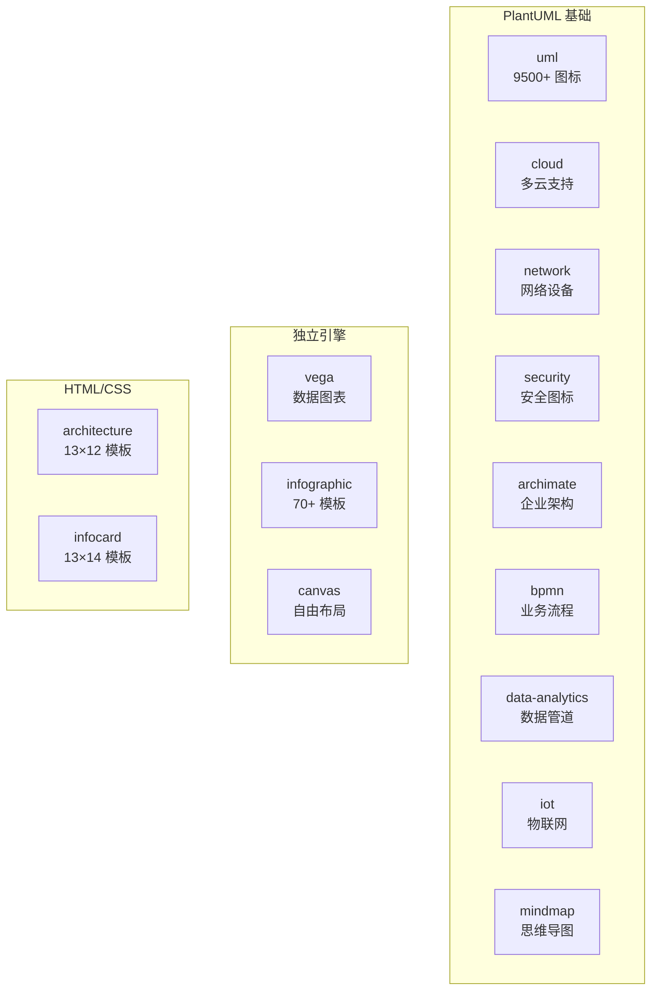

# Markdown Viewer Skills 项目分析报告

## 项目概览

**项目名称**: Markdown Viewer Agent Skills  
**GitHub Stars**: 1,731  
**主要语言**: Markdown  
**许可证**: MIT  
**项目描述**: Opinionated skills for AI coding agents to create stunning diagrams and visualizations

> 这是一组为 AI 编码代理设计的技能集合，用于直接在 Markdown 中创建精美的图表和可视化。包含 14 个技能，覆盖 5 种渲染引擎。

---

## 技术栈分析

### 核心渲染引擎
| 引擎 | 技能数量 | 输出格式 |
|------|----------|----------|
| **PlantUML** | 9 个 | SVG |
| **Vega/Vega-Lite** | 1 个 | SVG/Canvas |
| **HTML/CSS** | 2 个 | HTML |
| **JSON Canvas** | 1 个 | SVG |
| **YAML** | 1 个 | HTML |

### 技能格式
- **SKILL.md**: 标准技能文档格式
- **YAML Frontmatter**: 技能元数据
- **Code Fence**: 代码块语法标识

---

## 核心功能模块

### 1. 独立渲染技能 (Standalone)

| 技能 | Code Fence | 描述 | 最佳场景 |
|------|------------|------|----------|
| **vega** | `vega-lite` / `vega` | 数据驱动图表 | 柱状图、折线图、散点图、热力图 |
| **infographic** | `infographic` | 70+ 预设计模板 | KPI 卡片、时间线、漏斗图 |
| **canvas** | `canvas` | 空间节点图 | 思维导图、知识图谱 |

### 2. HTML/CSS 嵌入式技能

| 技能 | 模板数 | 描述 | 最佳场景 |
|------|--------|------|----------|
| **architecture** | 13 布局 × 12 样式 | 分层架构图 | 系统分层、微服务架构 |
| **infocard** | 13 布局 × 14 样式 | 信息卡片 | 知识摘要、数据高亮 |

### 3. PlantUML 基础技能

| 技能 | 描述 | 图标库 | 最佳场景 |
|------|------|--------|----------|
| **uml** | UML 图表 | 9500+ mxgraph 图标 | 软件建模、设计模式 |
| **cloud** | 云架构 | AWS/Azure/GCP/阿里云 | 云基础设施 |
| **network** | 网络拓扑 | Cisco/Citrix 设备 | 企业网络 |
| **security** | 安全架构 | IAM/防火墙/加密 | 威胁模型 |
| **archimate** | 企业架构 | ArchiMate 标准 | 业务/应用/技术层 |
| **bpmn** | 业务流程 | BPMN/EIP/精益 | 工作流自动化 |
| **data-analytics** | 数据分析 | 数据管道图标 | ETL/数据仓库 |
| **iot** | 物联网 | 传感器/边缘设备 | 智能家居/工厂 |
| **mindmap** | 思维导图 | 原生 PlantUML | 头脑风暴 |

---

## 代码结构概览

```
skills/
├── README.md                     # 项目说明
│
├── vega/                         # Vega-Lite 图表技能
│   ├── SKILL.md
│   └── examples/
│
├── infographic/                  # 信息图技能
│   ├── SKILL.md
│   └── references/
│
├── canvas/                       # JSON Canvas 技能
│   ├── SKILL.md
│   └── references/syntax.md
│
├── architecture/                 # 架构图技能 (HTML/CSS)
│   ├── SKILL.md
│   ├── layouts/                  # 13 种布局
│   │   ├── banner-center.md
│   │   ├── layer-layouts.md
│   │   ├── hub-spoke.md
│   │   └── ...
│   └── styles/                   # 12 种样式
│       ├── neon-dark.md
│       ├── ocean-teal.md
│       └── ...
│
├── infocard/                     # 信息卡片技能 (HTML/CSS)
│   ├── SKILL.md
│   ├── layouts/                  # 13 种布局
│   └── styles/                   # 14 种样式
│
├── uml/                          # UML 图表技能
│   ├── SKILL.md
│   └── examples/
│
├── cloud/                        # 云架构技能
│   ├── SKILL.md
│   └── examples/
│
├── network/                      # 网络拓扑技能
│   ├── SKILL.md
│   └── examples/
│
├── security/                     # 安全架构技能
│   ├── SKILL.md
│   └── examples/
│
├── archimate/                    # ArchiMate 技能
│   ├── SKILL.md
│   └── examples/
│
├── bpmn/                         # BPMN 技能
│   ├── SKILL.md
│   └── examples/
│
├── data-analytics/               # 数据分析技能
│   ├── SKILL.md
│   └── examples/
│
├── iot/                          # 物联网技能
│   ├── SKILL.md
│   └── examples/
│
└── mindmap/                      # 思维导图技能
    ├── SKILL.md
    └── examples/
```

---

## 关键实现亮点

### 1. 标准化 SKILL.md 格式
```markdown
---
name: skill-name
description: Brief description
metadata:
  author: Attribution
---

# Skill Title

## Critical Syntax Rules
...

## Templates
...

## Common Pitfalls
...
```

### 2. 代码围栏标识系统
| 技能 | Code Fence | 说明 |
|------|------------|------|
| Vega | `vega-lite` / `vega` | 数据可视化 |
| Infographic | `infographic` | YAML 语法 |
| Canvas | `canvas` | JSON Canvas |
| PlantUML 系列 | `plantuml` / `puml` | 统一标识 |
| Architecture | (无围栏) | 原始 HTML |
| Infocard | (无围栏) | 原始 HTML |

### 3. 丰富的模板系统

#### Architecture 布局 (13 种)
- banner-center: 横幅居中
- layer-layouts: 分层布局
- hub-spoke: 中心辐射
- pipeline: 管道流程
- grid-catalog: 网格目录
- 等等...

#### Architecture 样式 (12 种)
- neon-dark: 霓虹暗色
- ocean-teal: 海洋青绿
- ember-warm: 余烬暖色
- frost-clean: 霜白简洁
- 等等...

### 4. 图标库集成
- **mxgraph**: 9500+ 标准图标
- **AWS stdlib**: AWS 服务图标
- **Azure/GCP**: 云服务图标
- **Cisco/Citrix**: 网络设备图标
- **Kubernetes**: K8s 图标

### 5. 技能选择指南

#### 软件建模
| 需求 | 推荐技能 |
|------|----------|
| 流程图 | uml |
| 时序图 | uml |
| 状态机 | uml |
| 类图 | uml |

#### 数据可视化
| 需求 | 推荐技能 |
|------|----------|
| 柱状图/折线图 | vega |
| KPI 仪表板 | infographic |
| 时间线 | infographic |
| SWOT 分析 | infographic |

#### 架构设计
| 需求 | 推荐技能 |
|------|----------|
| 系统分层 | architecture |
| 微服务 | architecture |
| 云架构 | cloud |
| 网络拓扑 | network |

---

## 适用场景建议

### 最佳使用场景

#### 1. 技术文档增强
```markdown
使用 uml 技能绘制系统架构图
使用 vega 技能展示性能数据
使用 architecture 技能展示服务分层
```

#### 2. 项目管理
```markdown
使用 infographic 技能创建项目时间线
使用 bpmn 技能绘制业务流程
使用 mindmap 技能进行头脑风暴
```

#### 3. 数据分析报告
```markdown
使用 vega 技能创建交互式图表
使用 infocard 技能高亮关键指标
使用 data-analytics 技能展示数据管道
```

#### 4. 安全审计
```markdown
使用 security 技能绘制威胁模型
使用 network 技能展示网络拓扑
使用 archimate 技能展示安全架构
```

### 使用方式

#### 安装技能
```bash
npx skills add markdown-viewer/skills
```

#### 手动安装 (Claude Code)
```bash
cp -r skills/<skill-name> ~/.claude/skills/
```

#### 使用示例
```markdown
请使用 architecture 技能创建一个微服务架构图

```architecture
layers:
  - name: Frontend
    components:
      - Next.js App
      - React Components
  - name: API Gateway
    components:
      - Kong
  - name: Services
    components:
      - User Service
      - Order Service
```
```

---

## 项目链接

- **GitHub**: https://github.com/markdown-viewer/skills
- **Chrome 扩展**: https://chromewebstore.google.com/detail/markdown-viewer/jekhhoflgcfoikceikgeenibinpojaoi
- **Firefox 插件**: https://addons.mozilla.org/firefox/addon/markdown-viewer-extension/
- **VS Code 扩展**: https://marketplace.visualstudio.com/items?itemName=xicilion.markdown-viewer-extension
- **Agent Skills 格式**: https://agentskills.io/

---

## 技能生态系统



---

*分析时间: 2026-04-15*
